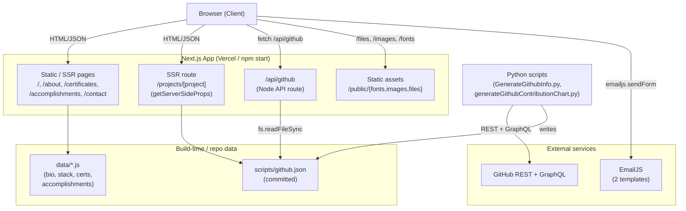
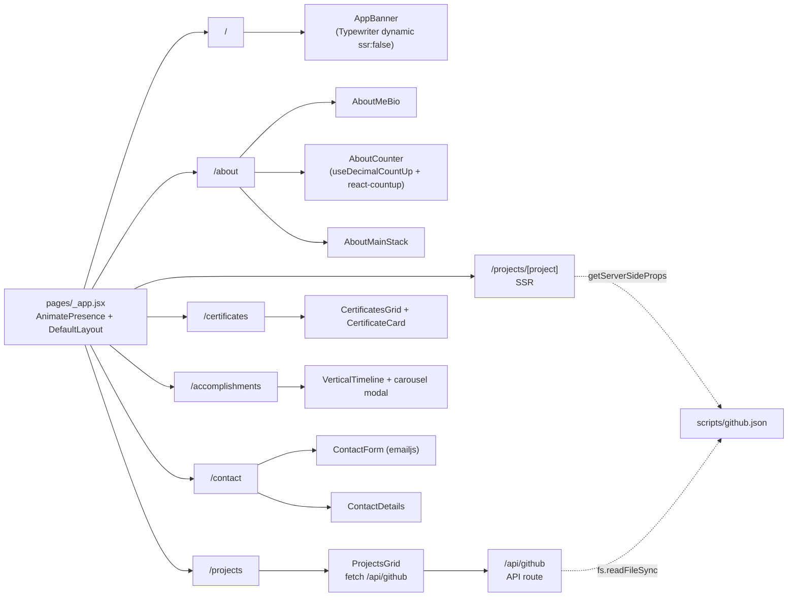
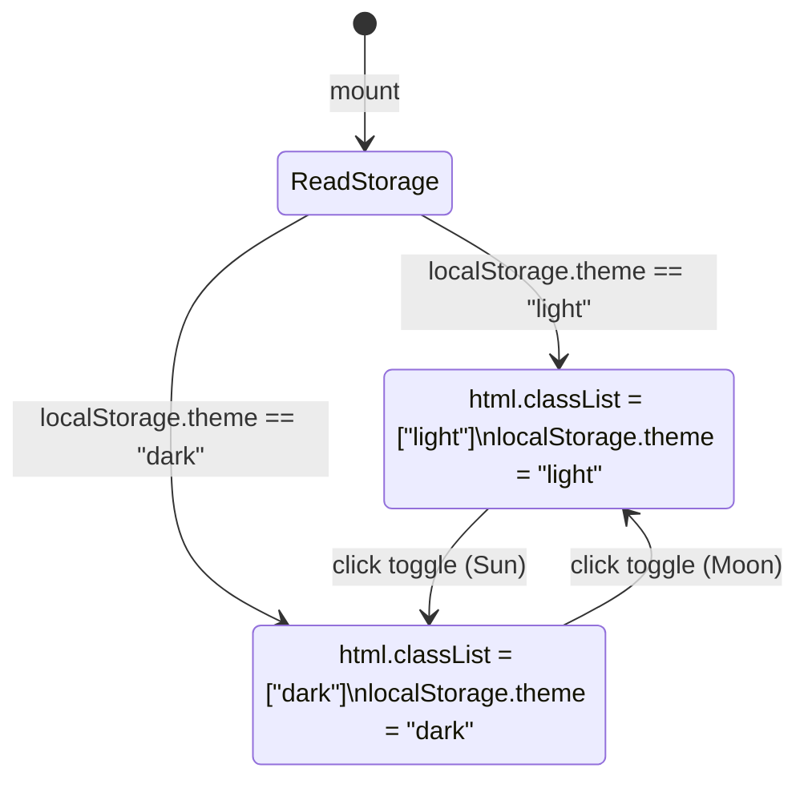
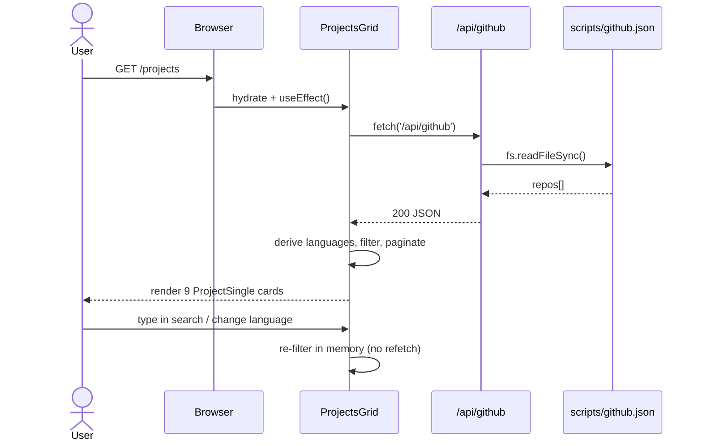
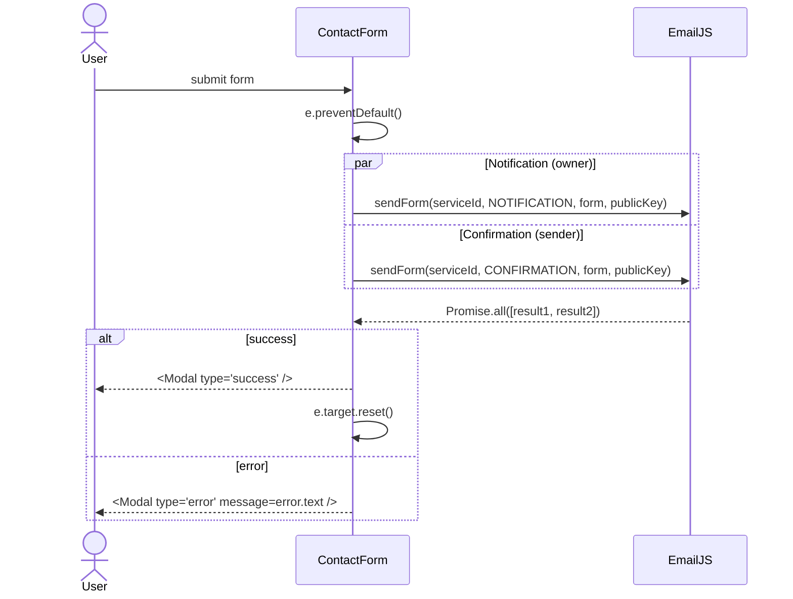
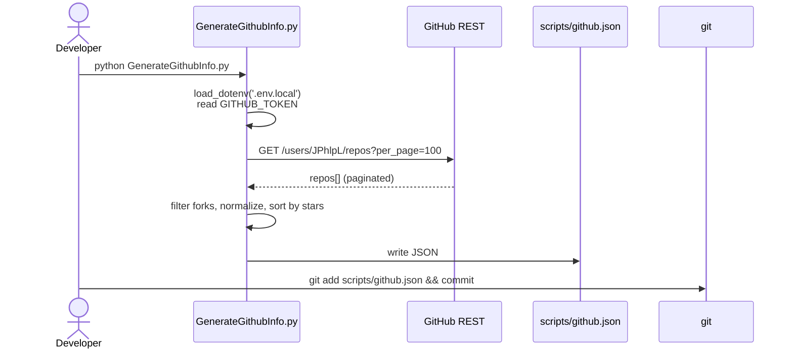

# Architecture

## Stack at a glance

| Layer            | Tech                                                                 |
| ---------------- | -------------------------------------------------------------------- |
| Framework        | **Next.js 13** (Pages Router, `reactStrictMode: true`)               |
| UI               | **React 18**, **Tailwind CSS v3** (`darkMode: 'class'`), `@tailwindcss/forms` |
| Animation        | **Framer Motion** (`AnimatePresence`, page-level `motion.div` fades) |
| Icons            | **react-icons** (`Fi`, `Md`, `Gr` sets)                              |
| Misc UI          | `typewriter-effect` (dynamic, `ssr: false`), `react-vertical-timeline-component`, `react-tooltip`, `react-countup`, `react-intersection-observer`, `react-chrono` |
| Email            | `emailjs-com` (browser-side dual-template send)                      |
| IDs              | `uuid` (data records)                                                |
| Data pipeline    | **Python 3** scripts hitting GitHub REST + GraphQL APIs              |
| Linting          | `eslint` + `eslint-config-next`                                      |

## Runtime topology



## Routing & rendering modes

- All routes live under `pages/` (classic Pages Router — no `app/` directory).
- `pages/projects/[project].jsx` uses `getServerSideProps` to look up a repo by name from `scripts/github.json` (imported at build/server time).
- `pages/api/github.js` is a Node API route that streams the same `scripts/github.json` to the client.
- Every other page is statically rendered with client-side hydration; data either comes from `data/*.js` modules or is fetched at runtime (`/api/github`).



## State management

There is **no global store** — state is local React state, with two cross-cutting concerns kept in custom hooks:

1. **`useThemeSwitcher`** (`hooks/useThemeSwitcher.jsx`) — toggles a `dark` / `light` class on `<html>` and persists to `localStorage.theme`. Tailwind's `darkMode: 'class'` reacts to this.
2. **`useScrollToTop`** (`hooks/useScrollToTop.jsx`) — listens to `window.scroll`, conditionally renders a chevron, smooth-scrolls to top.

A second component-local hook (`components/hooks/useDecimalCountUp.jsx`) wraps `requestAnimationFrame` for the years-of-experience counter on `/about`.



## Layout & theming

- `pages/_app.jsx` wraps every page in `AnimatePresence` → `<DefaultLayout>` → `<Component />` → `<UseScrollToTop />`.
- `components/layout/DefaultLayout.jsx` composes `PagesMetaHead` + `AppHeader` + children + `AppFooter`.
- Theme tokens (in `tailwind.config.js`):
  - Light: `primary-light #F7F8FC`, `secondary-light #FBFBFB`, `ternary-light #f6f7f8`
  - Dark:  `primary-dark  #0D2438`, `secondary-dark  #102D44`, `ternary-dark  #1E3851`
  - `gray` is overridden to Tailwind's `colors.neutral`.
- A complete **GeneralSans** font family is shipped in `public/fonts/` and registered in `styles/globals.css` (variable + per-weight `.woff2/.woff/.ttf` triplets).

## Data flow

| Surface                        | Source                                              | How it's read                              |
| ------------------------------ | --------------------------------------------------- | ------------------------------------------ |
| Bio paragraphs                 | `data/aboutMeData.js`                               | `import` in `AboutMeBio`                   |
| Tech stack tiles               | `data/mainStackData.js`                             | `import` in `AboutMainStack`               |
| Counters                       | Computed (`new Date()` math) + hard-coded `18`      | `AboutCounter` + `useDecimalCountUp`       |
| Certificates                   | `data/certificatesData.js`                          | `import` in `CertificatesGrid`             |
| Accomplishments timeline       | `data/accomplishmentsData.js`                       | `import` in `pages/accomplishments.jsx`    |
| Projects list                  | `scripts/github.json` ← Python script               | `fetch('/api/github')` in `ProjectsGrid`   |
| Project detail                 | `scripts/github.json` (server import)               | `getServerSideProps` in `[project].jsx`    |
| Contact form                   | EmailJS templates                                   | `emailjs.sendForm(serviceId, templateId, …)` with `NEXT_PUBLIC_*` keys |

### Projects list — request lifecycle



### Contact form — EmailJS dual-send



### GitHub data refresh — offline pipeline



## Build & dev scripts

```
npm run dev    # next dev — local @ :3000
npm run build  # next build
npm run start  # next start
npm run lint   # next lint
```

## External services

- **EmailJS** — `service_g6kwbpp` with two templates (notification to owner + confirmation to sender). Keys are exposed as `NEXT_PUBLIC_*` and read in `ContactForm.jsx`.
- **GitHub REST + GraphQL** — consumed offline by `scripts/*.py`; the resulting JSON is committed and served by the API route. The site itself never calls GitHub at request time.
- **Vercel** — implied deploy target (README links to `nextjs-tailwindcss-portfolio.vercel.app`; live profile linked to `jphlpl-portfolio-next.vercel.app`).

## Key architectural notes

- The project-detail route key is the GitHub **repo name** (`project.project`), not a numeric `id`. There is a `TODO` in `ProjectSingle.jsx` about migrating to `[id].jsx`.
- `data/projectsData.js` is **dead code** at the page level — current pages read GitHub data instead. It's preserved from the upstream template.
- Both `Modal` (success/error popup) and `HireMeModal` exist, but `HireMeModal` is **imported but not rendered** in `AppHeader.jsx` (no trigger wired up).
- The `Button` component (`components/reusable/Button.jsx`) is intentionally minimal — styling is applied by the parent `<span>` wrapper around it.
